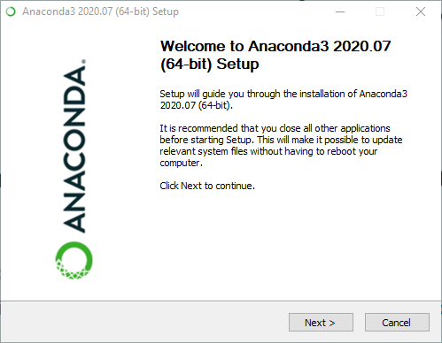

# Installing Anaconda

[Anaconda](https://www.anaconda.com/products/individual) is a Python distribution and package
management system. It provides an installation of Python (currently defaulting to Python 3.8)
and a way to create "virtual environments" that can contain different Python version and
software packages required for a specific task.

The official instructions for installing Anaconda on a variety of operating systems can be found
[here](https://docs.anaconda.com/anaconda/install/), but we will also go through the steps below.

!!! note
    The full Anaconda installation will require just under 3 Gb of space on your computer.
    
    For users who are confident using a text-based @(terminal) there is a much lighter weight
    installation that can be used called [Miniconda](https://docs.conda.io/en/latest/miniconda.html),
    which does not provide many of the graphical user interface tools.

=== "Installation on Windows 10"    
    * Visit [https://www.anaconda.com/products/individual](https://www.anaconda.com/products/individual)
      and scroll down until you see the Download options:

    

    * Under the "Windows <i class="fa fa-windows"></i>" option click on "64-bit Graphical
      Installer" to download the installation executable.
    * Click on the downloaded executable to start the setup (often via an icon now located at the
      bottom of you browser window), which should provide a window with instructions to follow:

    

    * Click the ++"Next >"++ button to begin installation.
    * Click ++"I Agree"++ in the "License Agreement" window.
    * On the "Select Installation Type" window you can either select to install for "Just me" or
      "All users". If you are the only user of your machine then either option is fine. If there
      are multiple users (i.e., it's a shared machine) then "Just me" can be used.
    * On the "Choose Install Location" window, unless you have a preferred install location for
      software, leave the install location as the default option. In general, if installing on
      your own machine, this will be "`C:\Users\<username>\anaconda3`", where "`<username>`"
      will be replaced with your own user name on the machine.
    * On the "Advanced Installation Options" window leave the tick in the box next to "Register
      Anaconda3 as my default Python 3.8" and click the ++"Install"++ button.
    * Once installation is complete continue clicking though with the ++"Next >"++ buttons and finally
      click ++"Finish"++ (if you leave the check boxes on the final window ticked, then links to
      tutorials will open in your browser).

=== "Installation on Mac OS"
    * Visit [https://www.anaconda.com/products/individual](https://www.anaconda.com/products/individual)
      and scroll down until you see the Download options:

    

    * Under the "MacOS <i class="fa fa-apple"></i>" option click on "64-bit Graphical
      Installer" to download the installation executable.


=== "Installation on Linux"
    For Linux users we recommend just installing the lightweight Miniconda package rather than the
    full Anaconda installation. Instructions for installing Miniconda under Linux can be found
    [here](https://docs.conda.io/projects/continuumio-conda/en/latest/user-guide/install/linux.html),
    which we summarise below.

    The instructions below are those for installation via command line only.

    * Download the [latest Miniconda installation](https://docs.conda.io/en/latest/miniconda.html#linux-installers) file from
      https://repo.anaconda.com/miniconda/Miniconda3-latest-Linux-x86_64.sh either via your browser
      or from the command line with, e.g.,

    ```bash
    wget https://repo.anaconda.com/miniconda/Miniconda3-latest-Linux-x86_64.sh
    ```

    * In the directory that you downloaded `Miniconda3-latest-Linux-x86_64.sh` run:

    ```bash
    bash Miniconda3-latest-Linux-x86_64.sh
    ```

When installed, the default Python version 

## Creating new environments

For 

=== "Anaconda Navigator"
    You 

=== "Command line"
    ###

## Installing packages

Within an environment you can install Python any packages that you require so long as they are
available within Conda or the PyPI package repository.

=== "Anaconda Navigator"


=== "Command line"
