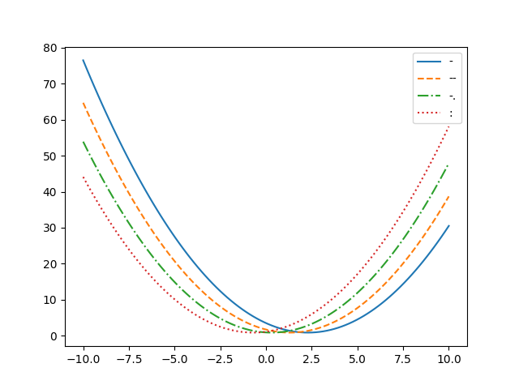
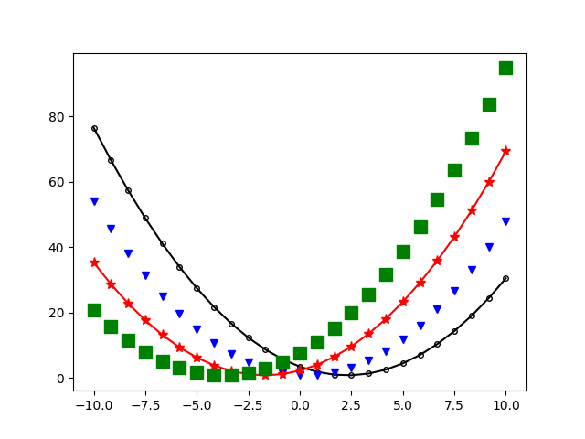
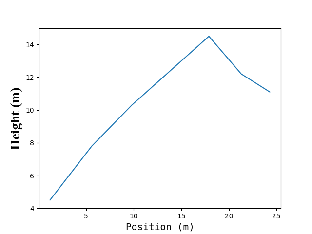

# Basic plotting with Matplotlib

[Matplotlib](https://matplotlib.org/) is a powerfullibrary for making plots in Python. It can be
used to create basic plots, but also has the ability to create very complex plots. A variety of
useful tutorials can be found on the [Matplotlib
webpage](https://matplotlib.org/3.3.1/tutorials/index.html), but here we will cover some of the
basics.

The plotting functions within Matplotlib are found within the
[`pyplot`](https://matplotlib.org/3.3.1/api/_as_gen/matplotlib.pyplot.html#module-matplotlib.pyplot)
submodule, which is often imported using the alias:

```python
from matplotlib import pyplot as plt
```

Here we will assume `pyplot` has been imported in this way. We will also be using
[NumPy](../demo-numpy/index.html) arrays to hold the data being plotted, although lists can also be
used.

## Basic line plot

A basic line plot can be produced using the
[`plot`](https://matplotlib.org/3.3.1/api/_as_gen/matplotlib.pyplot.plot.html#matplotlib.pyplot.plot)
function of `pyplot`. At its most basic `plot` takes a set of y-axis values:

```python
from matplotlib import pyplot as plt
import numpy as np

# create a quadratic curve
data = np.arange(0, 10) ** 2
plt.plot(data)

# plt.show() will open the plot in its own window
plt.show()
```


!!! note
    The [`show`](https://matplotlib.org/api/_as_gen/matplotlib.pyplot.show.html) function opens an
    interactive window showing the figure. This window allows you to zoom in on the figure and save
    the figure. By default, if using `show` the code, or terminal, will not continue until you
    close the figure window.

As seen above, the x-axis will just use the integer index values starting at 0.

You can control the x-axis values to use by passing them as the first argument to `plot`, e.g.,:

```python
x = np.linspace(-10, 10, 100)
y = 3.5 - 2.3 * x + 0.5 * x ** 2  # a more complex quadratic

# plot the data
plt.plot(x, y)
plt.show()
```


### Line styles and colours

The above plots default to a solid line in a blue colour. However, both the line style and colour
can be controlled. You can also control whether to show markers at each of the data points.

The line style can be set with the `linestyle` keyword argument (a shorthand of `ls` can also be
used), with the following values:

 * `"-"` or `"solid"` (this is the default)
 * `"--"` or `"dashed"`
 * `"-."` or `"dashdot"`
 * `":"` or `"dotted"`
 * `"None"`, `" "` or `""` for no line

```python
# show the different line styles
linestyles = ["-", "--", "-.", ":"]

x = np.linspace(-10, 10, 100)
for i, ls in enumerate(linestyles):
    y = 3.5 - 2.3 * (x + i) + 0.5 * (x + i) ** 2
    plt.plot(x, y, linestyle=ls, label=ls)

plt.legend()
plt.show()
```



The above example has also shown how to plot multiple data sets on top of each other. It just
requires running the `plot` command multiple times. The different lines will default to use
different colours.

The line colour can be set using the `color` keyword argument (note the US spelling). There are a
wide range of [named colours](https://matplotlib.org/3.1.0/gallery/color/named_colors.html) that can
be used, although there are a set of base colours for which only the first initial is required:

```python
import matplotlib.colors as mcolors

print(list(mcolors.BASE_COLORS))                                       
['b', 'g', 'r', 'c', 'm', 'y', 'k', 'w']
```


An example using a few of these colours is:

```python
colors = ["r", "g", "b", "k"]

x = np.linspace(-10, 10, 100)
for i, c in enumerate(colors):
    y = 3.5 - 2.3 * (x + i) + 0.5 * (x + i) ** 2
    plt.plot(x, y, color=c)

plt.show()
```


!!! note
    There are colourblind friendly colour palettes available, for example within the
    [`seaborn`](https://seaborn.pydata.org/tutorial/color_palettes.html#qualitative-color-palettes)
    package.

#### Marker styles

In the above example just the line has been plotted, but markers can also be added for each data
point. The marker style can be set with the `marker` keyword argument. The full range of marker
styles are listed on the [marker page](https://matplotlib.org/api/markers_api.html), but here we
will list a few:

 * `"."` - a point
 * `"o"` - a circle
 * `"v"` - a downwards pointing triangle
 * `"*"` - a star
 * `"+"` - a plus
 * `"x"` - a cross
 * `"s"` - a square

The marker size can be set with the `markersize` keyword argument, and whether the marker is filled
or not can be set using the `markerfacecolor` keyword argument:

```python
markers = ["o", "v", "*", "s"]
markersizes = [4, 6, 8, 10]
markerfacecolors = ["None", "b", "r", "g"]
colors = ["k", "b", "r", "g"]
linestyles = ["-", "None", "-", "None"]  # set to show lines for alternate cases

x = np.linspace(-10, 10, 25)
for i in range(len(markers)):
    y = 3.5 - 2.3 * (x + 2 * i) + 0.5 * (x + 2 * i) ** 2
    plt.plot(
        x,
        y,
        marker=markers[i],
        markersize=markersizes[i],
        markerfacecolor=markerfacecolors[i],
        color=colors[i],
        linestyle=linestyles[i]
    )

plt.show()
```



### Axis labels

The above plots were missing important information. Plots should always have axis labels!

Labels can be added to the x- and y-axes using the
[`xlabel`](https://matplotlib.org/3.2.1/api/_as_gen/matplotlib.pyplot.xlabel.html#matplotlib.pyplot.xlabel)
and
[`ylabel`](https://matplotlib.org/3.2.1/api/_as_gen/matplotlib.pyplot.ylabel.html#matplotlib.pyplot.ylabel)
functions, e.g.,:

```python
# some example data
position = [1.2, 5.6, 9.8, 17.9, 21.3, 24.3]
height = [4.5, 7.8, 10.3, 14.5, 12.2, 11.1]

plt.plot(position, height)
plt.xlabel("Position (m)")
plt.ylabel("Height (m)")
plt.show()
```


The font and font size for the axes labels, and many other [font
effects](https://matplotlib.org/3.2.1/api/text_api.html#matplotlib.text.Text), can be controlled
with the `fontfamily` and `fontsize` keyword arguments, e.g.,

```python
plt.plot(position, height)
plt.xlabel("Position (m)", fontfamily="Monospace", fontsize=14)
# use a different font size for y-axis as an example
plt.ylabel("Height (m)", fontfamily="Times New Roman", fontsize=20)
plt.show()
```



If you want to use mathematical text, or Greek lettering, in axes labels you can used LaTeX-like
commands enclosed in dollar signs, e.g.,

```python
x = np.linspace(-10, 10, 100)
y = x ** 2  # a quadratic

plt.plot(x, y)
# use LaTeX math in labels
plt.xlabel("$\eta$", fontsize=16)
plt.ylabel("$f(\eta) = \eta^2$", fontsize=16)
plt.show()
```


### Legends

If you have multiple data sets on a single plot it is useful to differentiate them with different
line colours, line styles, and/or marker styles. By default Matplotlib will use different colours
for multiple data sets, but as shown above you can control what line colours are used.

You can add labels to each data set that you plot using the `label` keyword argument to `plot`.
These "labels" can then be used in a legend using the
[`legend`](https://matplotlib.org/3.2.1/api/_as_gen/matplotlib.pyplot.legend.html?highlight=legend#matplotlib.pyplot.legend)
function.

```python
x = np.arange(10)

# create from data sets
y1 = np.random.randn(len(x))  # noise
y2 = np.random.randn(len(x)) + 3 * x  # noise and line
y3 = np.random.randn(len(x)) + 1.5 * x ** 2  # noise and quadratic

# plot data with labels
plt.plot(x, y1, color="b", label="Data 1")
plt.plot(x, y2, color="r", label="Data 2")
plt.plot(x, y3, color="g", label="Data 3")

plt.xlabel("x")
plt.ylabel("y")

# add legend
plt.legend()
plt.show()
```


## Basic scatter plot

## Basic histogram

## Saving figures

## Customisation

### Using axes and figures

### Multiple plots in a figure

### Setting up default parameters
