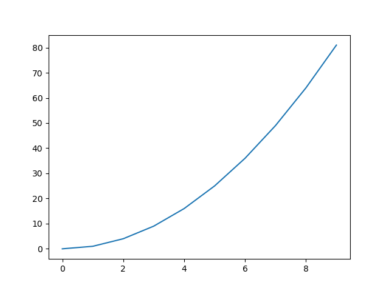

# Basic plotting with Matplotlib

[Matplotlib](https://matplotlib.org/) is a powerfullibrary for making plots in Python. It can be
used to create basic plots, but also has the ability to create very complex plots. A variety of
useful tutorials can be found on the [Matplotlib
webpage](https://matplotlib.org/3.3.1/tutorials/index.html), but here we will cover some of the
basics.

The plotting functions within Matplotlib are found within the
[`pyplot`](https://matplotlib.org/3.3.1/api/_as_gen/matplotlib.pyplot.html#module-matplotlib.pyplot)
submodule, which is often imported using the alias:

```python
from matplotlib import pyplot as plt
```

Here we will assume `pyplot` has been imported in this way. We will also be using
[NumPy](../demo-numpy/index.html) arrays to hold the data being plotted, although lists can also be
used.

## Basic line plot

A basic line plot can be produced using the
[`plot`](https://matplotlib.org/3.3.1/api/_as_gen/matplotlib.pyplot.plot.html#matplotlib.pyplot.plot)
function of `pyplot`. At its most basic `plot` takes a set of y-axis values:

```python
from matplotlib import pyplot as plt
import numpy as np

# create a quadratic curve
data = np.arange(0, 10) ** 2
plt.plot(data)

# plt.show() will open the plot in its own window
plt.show()
```



As seen above, the x-axis will just use the integer index values starting at 0.

You can control the x-axis values to use by passing them as the first argument to `plot`, e.g.,:

```python
x = np.linspace(-10, 10, 100)
y = 3.5 - 2.3 * x + 0.5 * x ** 2  # a more complex quadratic

# plot the data
plt.plot(x, y)
plt.show()
```


### Line styles and colours

The above plots default to a solid line in a blue colour. However, both the line style and colour
can be controlled. You can also control whether to show markers at each of the data points.

The line style can be set with the `linestyle` keyword argument (a shorthand of `ls` can also be
used), with the following values:

 * `"-"` or `"solid"` (this is the default)
 * `"--"` or `"dashed"`
 * `"-."` or `"dashdot"`
 * `":"` or `"dotted"`
 * `"None"`, `" "` or `""` for no line

```python
# show the different line styles
linestyles = ["-", "--", "-.", ":"]

x = np.linspace(-10, 10, 100)
for i, ls in enumerate(linestyles):
    y = 3.5 - 2.3 * (x + i) + 0.5 * (x + i) ** 2
    plt.plot(x, y, linestyle=ls, label=ls)

plt.legend()
plt.show()
```


The above example has also shown how to plot multiple data sets on top of each other. It just
requires running the `plot` command multiple times. The different lines will default to use
different colours.

### Axis labels

Plots should always have axis labels!

### Legends

## Basic scatter plot

## Basic histogram

## Saving figures

## Customisation

