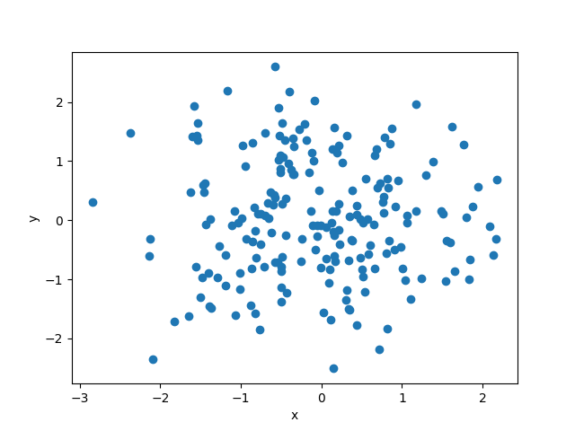
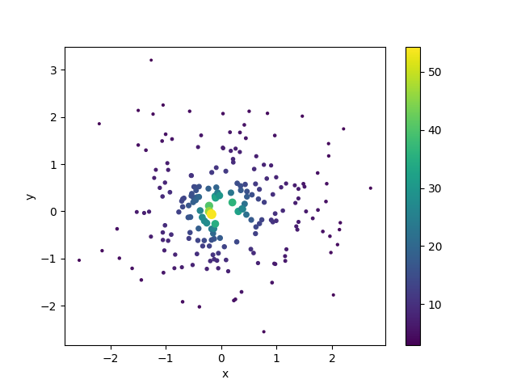
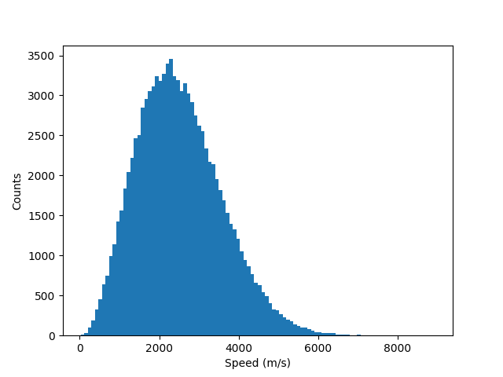
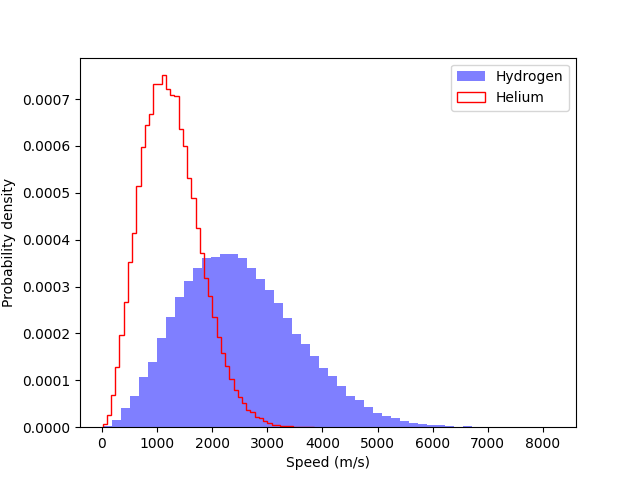
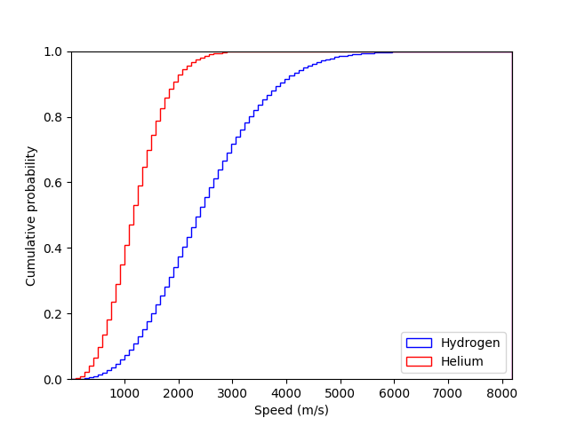

# Basic plotting with Matplotlib

[Matplotlib](https://matplotlib.org/) is a powerfullibrary for making plots in Python. It can be
used to create basic plots, but also has the ability to create very complex plots. A variety of
useful tutorials can be found on the [Matplotlib
webpage](https://matplotlib.org/3.3.1/tutorials/index.html), but here we will cover some of the
basics.

The plotting functions within Matplotlib are found within the
[`pyplot`](https://matplotlib.org/3.3.1/api/_as_gen/matplotlib.pyplot.html#module-matplotlib.pyplot)
submodule, which is often imported using the alias:

```python
from matplotlib import pyplot as plt
```

Here we will assume `pyplot` has been imported in this way. We will also be using
[NumPy](../demo-numpy/index.html) arrays to hold the data being plotted, although lists can also be
used.

## Basic line plot

A basic line plot can be produced using the
[`plot`](https://matplotlib.org/3.3.1/api/_as_gen/matplotlib.pyplot.plot.html#matplotlib.pyplot.plot)
function of `pyplot`. At its most basic `plot` takes a set of y-axis values:

```python
from matplotlib import pyplot as plt
import numpy as np

# create a quadratic curve
data = np.arange(0, 10) ** 2
plt.plot(data)

# plt.show() will open the plot in its own window
plt.show()
```


!!! note
    The [`show`](https://matplotlib.org/api/_as_gen/matplotlib.pyplot.show.html) function opens an
    interactive window showing the figure. This window allows you to zoom in on the figure and save
    the figure. By default, if using `show` the code, or terminal, will not continue until you
    close the figure window.

As seen above, the x-axis will just use the integer index values starting at 0.

You can control the x-axis values to use by passing them as the first argument to `plot`, e.g.,:

```python
x = np.linspace(-10, 10, 100)
y = 3.5 - 2.3 * x + 0.5 * x ** 2  # a more complex quadratic

# plot the data
plt.plot(x, y)
plt.show()
```


### Line styles and colours

The above plots default to a solid line in a blue colour. However, both the line style and colour
can be controlled. You can also control whether to show markers at each of the data points.

The line style can be set with the `linestyle` keyword argument (a shorthand of `ls` can also be
used), with the following values:

 * `"-"` or `"solid"` (this is the default)
 * `"--"` or `"dashed"`
 * `"-."` or `"dashdot"`
 * `":"` or `"dotted"`
 * `"None"`, `" "` or `""` for no line

```python
# show the different line styles
linestyles = ["-", "--", "-.", ":"]

x = np.linspace(-10, 10, 100)
for i, ls in enumerate(linestyles):
    y = 3.5 - 2.3 * (x + i) + 0.5 * (x + i) ** 2
    plt.plot(x, y, linestyle=ls, label=ls)

plt.legend()
plt.show()
```


The above example has also shown how to plot multiple data sets on top of each other. It just
requires running the `plot` command multiple times. The different lines will default to use
different colours.

The line colour can be set using the `color` keyword argument (note the US spelling). There are a
wide range of [named colours](https://matplotlib.org/3.1.0/gallery/color/named_colors.html) that can
be used, although there are a set of base colours for which only the first initial is required:

```python
import matplotlib.colors as mcolors

print(list(mcolors.BASE_COLORS))                                       
['b', 'g', 'r', 'c', 'm', 'y', 'k', 'w']
```


An example using a few of these colours is:

```python
colors = ["r", "g", "b", "k"]

x = np.linspace(-10, 10, 100)
for i, c in enumerate(colors):
    y = 3.5 - 2.3 * (x + i) + 0.5 * (x + i) ** 2
    plt.plot(x, y, color=c)

plt.show()
```


!!! note
    There are colourblind friendly colour palettes available, for example within the
    [`seaborn`](https://seaborn.pydata.org/tutorial/color_palettes.html#qualitative-color-palettes)
    package.

#### Marker styles

In the above example just the line has been plotted, but markers can also be added for each data
point. The marker style can be set with the `marker` keyword argument. The full range of marker
styles are listed on the [marker page](https://matplotlib.org/api/markers_api.html), but here we
will list a few:

 * `"."` - a point
 * `"o"` - a circle
 * `"v"` - a downwards pointing triangle
 * `"*"` - a star
 * `"+"` - a plus
 * `"x"` - a cross
 * `"s"` - a square

The marker size can be set with the `markersize` keyword argument, and whether the marker is filled
or not can be set using the `markerfacecolor` keyword argument:

```python
markers = ["o", "v", "*", "s"]
markersizes = [4, 6, 8, 10]
markerfacecolors = ["None", "b", "r", "g"]
colors = ["k", "b", "r", "g"]
linestyles = ["-", "None", "-", "None"]  # set to show lines for alternate cases

x = np.linspace(-10, 10, 25)
for i in range(len(markers)):
    y = 3.5 - 2.3 * (x + 2 * i) + 0.5 * (x + 2 * i) ** 2
    plt.plot(
        x,
        y,
        marker=markers[i],
        markersize=markersizes[i],
        markerfacecolor=markerfacecolors[i],
        color=colors[i],
        linestyle=linestyles[i]
    )

plt.show()
```


### Axis labels

The above plots were missing important information. Plots should always have axis labels!

Labels can be added to the x- and y-axes using the
[`xlabel`](https://matplotlib.org/3.2.1/api/_as_gen/matplotlib.pyplot.xlabel.html#matplotlib.pyplot.xlabel)
and
[`ylabel`](https://matplotlib.org/3.2.1/api/_as_gen/matplotlib.pyplot.ylabel.html#matplotlib.pyplot.ylabel)
functions, e.g.,:

```python
# some example data
position = [1.2, 5.6, 9.8, 17.9, 21.3, 24.3]
height = [4.5, 7.8, 10.3, 14.5, 12.2, 11.1]

plt.plot(position, height)
plt.xlabel("Position (m)")
plt.ylabel("Height (m)")
plt.show()
```


The font and font size for the axes labels, and many other [font
effects](https://matplotlib.org/3.2.1/api/text_api.html#matplotlib.text.Text), can be controlled
with the `fontfamily` and `fontsize` keyword arguments, e.g.,

```python
plt.plot(position, height)
plt.xlabel("Position (m)", fontfamily="Monospace", fontsize=14)
# use a different font size for y-axis as an example
plt.ylabel("Height (m)", fontfamily="Times New Roman", fontsize=20)
plt.show()
```


If you want to use mathematical text, or Greek lettering, in axes labels you can used LaTeX-like
commands enclosed in dollar signs, e.g.,

```python
x = np.linspace(-10, 10, 100)
y = x ** 2  # a quadratic

plt.plot(x, y)
# use LaTeX math in labels
plt.xlabel("$\eta$", fontsize=16)
plt.ylabel("$f(\eta) = \eta^2$", fontsize=16)
plt.show()
```


### Legends

If you have multiple data sets on a single plot it is useful to differentiate them with different
line colours, line styles, and/or marker styles. By default Matplotlib will use different colours
for multiple data sets, but as shown above you can control what line colours are used.

You can add labels to each data set that you plot using the `label` keyword argument to `plot`.
These "labels" can then be used in a legend using the
[`legend`](https://matplotlib.org/3.2.1/api/_as_gen/matplotlib.pyplot.legend.html?highlight=legend#matplotlib.pyplot.legend)
function.

```python
x = np.arange(10)

# create from data sets
y1 = np.random.randn(len(x))  # noise
y2 = np.random.randn(len(x)) + 3 * x  # noise and line
y3 = np.random.randn(len(x)) + 1.5 * x ** 2  # noise and quadratic

# plot data with labels
plt.plot(x, y1, color="b", label="Data 1")
plt.plot(x, y2, color="r", label="Data 2")
plt.plot(x, y3, color="g", label="Data 3")

plt.xlabel("x")
plt.ylabel("y")

# add legend
plt.legend()
plt.show()
```


By default the location of the legend will be set to try and avoid overlapping with most of the
data. The legend location can be set explicitly to a particular place using the `loc` keyword
argument and a location string, e.g.,:

 * `"upper right"`
 * `"upper left"`
 * `"lower right"`
 * `"lower left"`

## Basic scatter plot

The `plot` function will produce a line plot, but by setting the line style to be `"None"` and
explicitly giving a marker style it can be used to produce a scatter plot, i.e., a plot of
individual points, e.g.,

```python
# produce some random points
x = np.random.randn(200)
y = np.random.randn(200)

# plot data points using circle markers
plt.plot(x, y, linestyle="None", marker="o")
plt.xlabel("x")
plt.ylabel("y")
plt.show()
```



An alternative is to the use
[`scatter`](https://matplotlib.org/api/_as_gen/matplotlib.pyplot.scatter.html?highlight=scatter#matplotlib.pyplot.scatter)
function in `pyplot`. This adds the ability to add an additional dimension of information to the
plot in the form the the size and/or colour of the points, using the `s` and `c` keyword arguments,
respectively. For example,

```python
# produce some random points
x = np.random.randn(200)
y = np.random.randn(200)

# third dimension
z = 10 / np.sqrt(x ** 2 + y ** 2)

# plot data using scatter, with size and color representing "z" data
plt.scatter(x, y, s=z, c=z)
plt.colorbar()
plt.xlabel("x")
plt.ylabel("y")
plt.show()
```



In the above example the
[`colorbar`](https://matplotlib.org/api/_as_gen/matplotlib.pyplot.colorbar.html?highlight=colorbar#matplotlib.pyplot.colorbar)
function has been used to add a colour bar on the right hand side representing the z-axis values.

!!! note
    You can plot with different plotting functions on the same plot, i.e., the `plot` function and
    the `scatter` function, e.g.,

    ```python
    x = np.random.randn(200)
    y = np.random.randn(200)
    z = 10 / np.sqrt(x ** 2 + y ** 2)

    # plot data using scatter, with color representing "z" data
    plt.scatter(x, y, c=z)

    # overplot a line plot
    linex = np.linspace(-4, 4, 10)
    liney = 1.5 + linex + 0.5
    plt.plot(linex, liney, color="r")

    plt.show()
    ```

    

## Basic histogram

Sometimes you need count the number of data points within set ranges of values. This is called
"binning", i.e., a count of the data in each "bin" or interval. A plot of the binned data is called
a histogram and this can be made using the
[`hist`](https://matplotlib.org/api/_as_gen/matplotlib.pyplot.hist.html?highlight=hist#matplotlib.pyplot.hist)
function in `pyplot`.

For example, if we had measured the speed of a set of particles, we could look at the distribution
of speeds using a histogram:

```python
# create a set of Hydrogen atoms at ~room temperature
from scipy.stats import maxwell
m = 1.67e-27  # proton mass (kg)
kb = 1.38e-23  # Boltzmann constant (m^2 ks s^-2 K^-1)
T = 300  # temperature (K)

natoms = 100000  # number of atoms
speeds = maxwell.rvs(scale=np.sqrt(kb * T / m), size=natoms)

# plot distribution of atom speeds
plt.hist(speeds, bins=100)
plt.xlabel("Speed (m/s)")
plt.ylabel("Counts")
plt.show()
```



In the above example, the number of "bins" has been set to 100 using `bins=100`, and the `hist`
function has created 100 equal size bins between the smallest and largest values (`bins` defaults to
10 bins). The `bins` keyword argument can also be set using an array of bin edge values, which do
not have to be the same size.

To create a histogram that is normalised, i.e., the y-axis does not represent counts, but instead
makes the area under the curve equal to one, you can set the `density` keyword argument to `True`.

An example showing two normalised histograms, one filled with colour, and the other unfilled, is
shown below:

```python
# create a set of Hydrogen atoms at ~room temperature
m = 1.67e-27  # proton mass (kg)
kb = 1.38e-23  # Boltzmann constant (m^2 ks s^-2 K^-1)
T = 300  # temperature (K)

natoms = 100000  # number of atoms
Hspeeds = maxwell.rvs(scale=np.sqrt(kb * T / m), size=natoms)

# create a set of Helium atoms at room temperature
Hespeeds = maxwell.rvs(scale=np.sqrt(kb * T / (4 * m)), size=natoms)

# plot probability density of speed distributions
plt.hist(Hspeeds, bins=50, density=True, color="b",
         histtype="stepfilled", alpha=0.5, label="Hydrogen")
plt.hist(Hespeeds, bins=50, density=True, color="r",
         histtype="step", label="Helium")
plt.xlabel("Speed (m/s)")
plt.ylabel("Probability density")
plt.legend()
plt.show()
```



The `hist` function can also be used to plot the cumulative distribution, e.g.,

```python
# set bins edges
bins = np.linspace(
    min([Hspeeds.min(), Hespeeds.min()]),
    max([Hspeeds.max(), Hespeeds.max()]),
    100
)

plt.hist(Hspeeds, bins=bins, cumulative=True, density=True, color="b",
         histtype="stepfilled", alpha=0.5, label="Hydrogen")
plt.hist(Hespeeds, bins=bins, cumulative=True, density=True, color="r",
         histtype="step", label="Helium")
plt.xlabel("Speed (m/s)")
plt.ylabel("Cumulative probability")
plt.legend(loc="upper left")
plt.show()
```



## Saving figures

## Customisation

### Using axes and figures

### Multiple plots in a figure

### Setting up default parameters
